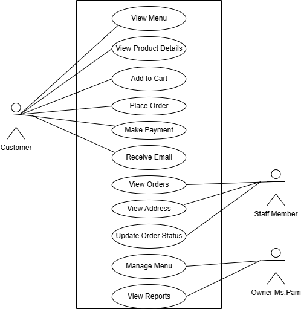
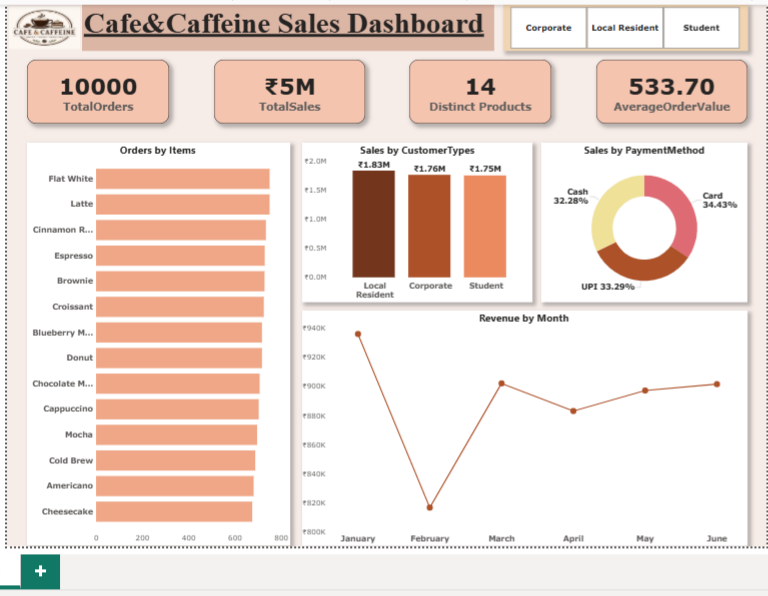

# ☕ Cafe&Caffeine Case Study: Business Analysis & Sales Analytics Project
End-to-end Business Analysis and Sales Analytics project for a coffee shop, including Requirement Gathering, BRD, FRD, User Stories, RTM, Use Case Diagram, and an interactive Power BI dashboard built using 10,000 transaction records.


## 📌 Project Overview
Cafe & Caffeine is a popular coffee shop known for its strong coffee and sweet treats. As customer demand increased, the manual ordering process led to delays, limited menu visibility, and operational inefficiencies.
To address these challenges, a Business Analysis case study was conducted to propose an Online Ordering & Delivery System. Additionally, a Power BI dashboard was developed using transactional sales data to analyze customer behavior, product performance, revenue trends, and payment preferences.

## 🎯 Business Problem
Ms. Pam, owner of Cafe & Caffeine, identified several challenges:
- Customers experienced delays while placing orders.
- Customers had limited visibility of the menu and new products.
- Staff faced difficulties managing orders efficiently.
- No centralized system existed for online ordering and payments.
- Business performance metrics were not being tracked effectively.

## 💡 Proposed Solution
Develop an Online Ordering & Delivery System that allows customers to:
- Browse menu items
- View product details
- Place online orders
- Make secure online payments
- Receive order confirmations

The solution also provides a staff portal to manage orders and delivery information efficiently.

---

## 👩‍💼 Business Analysis Deliverables
### Requirement Gathering
- Stakeholder Analysis
- Business Problem Identification
- Requirement Elicitation
### Documentation
- Business Requirements Document (BRD)
- Functional Requirements Document (FRD)
- User Stories
- Acceptance Criteria
- MoSCoW Prioritization
- Requirements Traceability Matrix (RTM)
### UML Modeling
- Use Case Diagram

---

## 📌 Use Case Diagram

The following Use Case Diagram illustrates the interactions between Customers, Staff Members, and the Owner within the Cafe & Caffeine Online Ordering System.


---
## 📊 Data Analytics Phase

### Dataset
- 10,000 Transaction Records
- Period: January 2025 – June 2025

### Fields
- Transaction ID
- Item
- Order Date
- Quantity
- Price Per Unit
- Payment Method
- Customer Type

## Dashboard Visualizations

---

## 🔍 Key Insights
### Customer Analysis
- Local Resident customers generated the highest revenue contribution.
- Corporate and Student customers also contributed significantly to overall sales.
### Payment Analysis
- Card payments were the most preferred payment method.
- UPI adoption was nearly equal to card payments, indicating strong digital payment usage.
### Product Analysis
- Flat White emerged as one of the most ordered products.
- Coffee products consistently outperformed sweet treats in total orders.
### Revenue Trends
- Revenue remained relatively stable across the six-month period.
- February recorded the lowest monthly revenue.
- Revenue recovered during March and maintained steady growth through June.
### Business Recommendations
- Promote top-performing coffee products through targeted campaigns.
- Introduce loyalty offers for Local Resident customers.
- Expand digital payment incentives to encourage faster transactions.
- Monitor low-performing products and optimize menu offerings.

---

## 🛠 Tools & Technologies

### Business Analysis
- Microsoft Word
- Draw.io

### Data Analytics
- Microsoft Excel
- Power BI

---

## 📂 Project Structure

```text
Cafe & Caffeine Business Analysis Project
│
├── Cafe_Caffeine_Requirement_Gathering.pdf
├── Cafe_Caffeine_BRD.pdf
├── Cafe_Caffeine_FRD.pdf
├── Cafe_Caffeine_User_Stories.pdf
├── Cafe_Caffeine_RTM.docx
├── Cafe&CaffeineUseCase.png
├── cafecaffeine.csv
├── Cafe&Caffeine_Sales_Dashboard.pbix
└── README.md
```

---

## 🚀 Project Outcome
This project demonstrates end-to-end Business Analysis and Data Analytics skills, including requirement gathering, stakeholder analysis, business documentation, UML modeling, dashboard development, KPI tracking, and business insight generation to support operational improvements and business growth.
